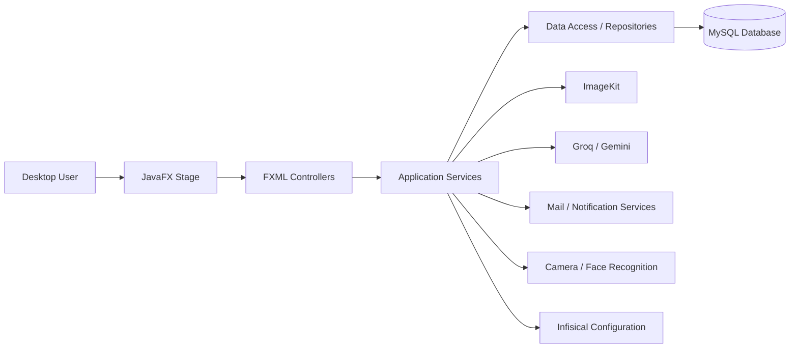
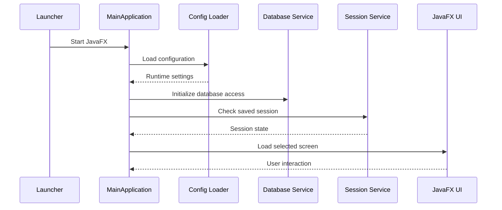
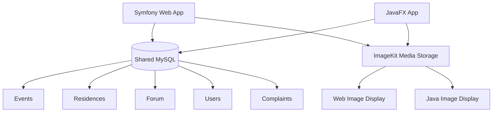
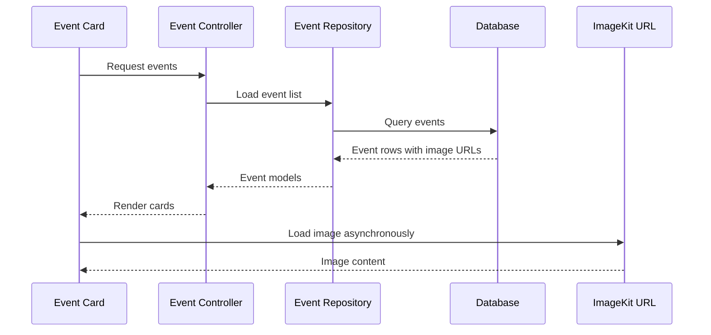
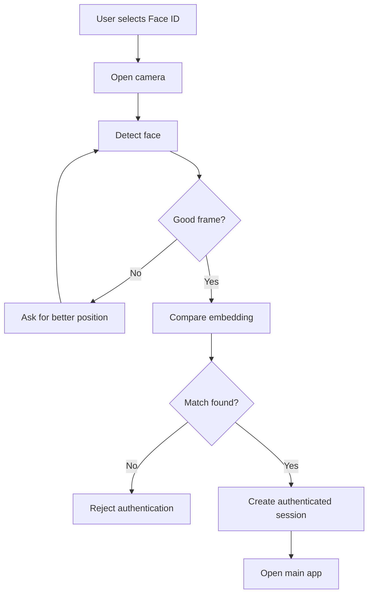
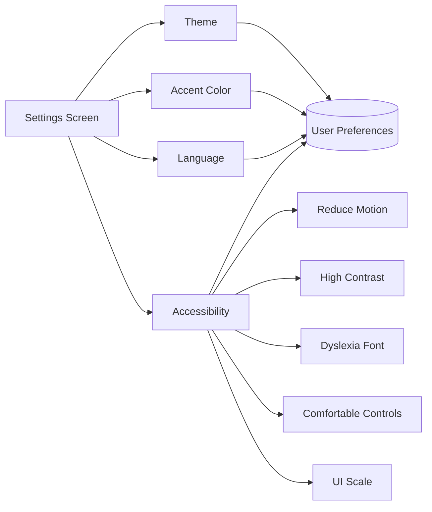
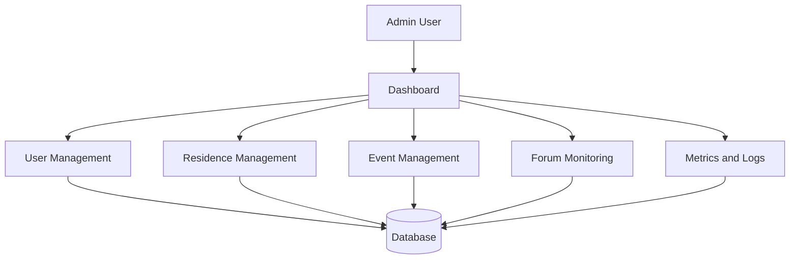

# Syndicati Java - Diagrams

## 1. Desktop Application Architecture

## 2. Startup Flow

## 3. Shared Data With Web

## 4. Event Image Loading

## 5. Face Authentication Flow

## 6. Settings Flow

## 7. Admin Dashboard Flow

